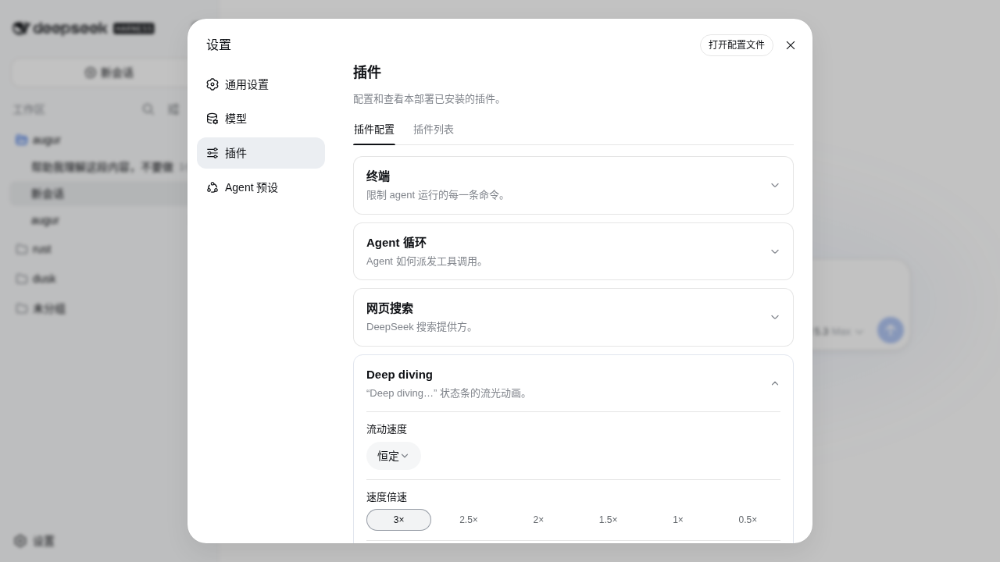
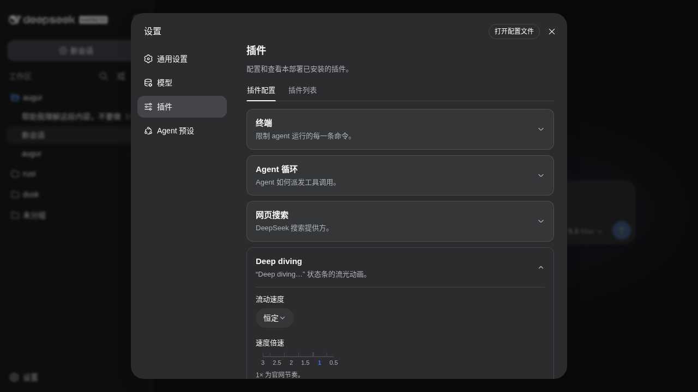

# dsh-plugin-deepdiving

Continuous water-flow light for the [DeepSeek Harness](https://github.com/deepseek-ai/deepseek-harness) (dsh) web "Deep diving…" turn status.

为 dsh web 端的 "Deep diving…" 运行状态条提供连续流动的水流光影。

---

## Why

The stock effect is a single pale band sweeping a flat-blue text every 1.8s — between sweeps the label is static, so the water stops. This plugin keeps the glyphs under a permanent current: three parallax gradient layers flow left→right like a river — a broad slow color undulation as the bed, medium highlight waves over it, and fast narrow sparkle streaks on the surface.

原版效果是一条淡色光带每 1.8s 扫过一次静态蓝字——两次扫过之间文字是静止的，"水"会停下来。本插件让文字永远处于水流之中：三层视差渐变从左向右流动——底层是宽幅缓慢的色浪河床，中层是斜切高光波浪，表层是快速掠过的窄亮流光。

| Stock 原版 | Deepdiving 本插件 |
|:---:|:---:|
| single band, mostly flat | three parallax currents, never stops |

Close-up — the water-flow on "Deep diving…", one complete 6s cycle compressed to 2.4s. APNG with full 8-bit alpha: transparent background (reads correctly on light and dark GitHub themes), smooth glyph edges, and the 25%-opacity glow intact. A 1-bit-alpha `demo.gif` sits alongside for GIF-only consumers. Full stock-vs-flow comparison with a live theme toggle in the [standalone demo](docs/demo.html):


Verified live on dsh `0.1.0-rc.6` (stock hashed class `Md3f7G_turnStatus`, GLM turn running): the plugin's animation, layers, and dark-theme brightening all resolve on the real element. 已在 dsh `0.1.0-rc.6` 真实会话中验证（原版哈希类名、GLM 思考中）：动画、分层、暗色提亮均在真实元素上生效。

## Install

```sh
dsh plugin --profile web add dsh-plugin-deepdiving
# or: dsh plugin --profile web add github:iluluyu/dsh-plugin-deepdiving
```

Restart `dsh web` and reload. Uninstall: `dsh plugin --profile web remove dsh-plugin-deepdiving`.

重启 `dsh web` 并刷新浏览器即可。卸载：`dsh plugin --profile web remove dsh-plugin-deepdiving`。

## Speed alignment

Measured from chat.deepseek.com's production stylesheet, the official thinking shimmer is `2s ease-out infinite` — one 70%-white band sweeping two text widths (`translate(-100%)→(100%)`, 10% tail pause), with a perceived mid-sweep pace of ~1.5 text widths/s. This plugin's constant default is **4s**, at which the mid layer moves at exactly 1.50w/s — the official cadence — while the sparkle layer reads as surface ripples and the bed layer as slower depth. Follow mode's ceiling is also 4s, so the water never outruns the official cadence; its floor is 12s still water.

## Performance

Pure CSS: zero JS per frame, zero layout. Measured via CDP `Performance.getMetrics` over a 4s window with the animation running: Script 0.003s, Layout 0.000s, RecalcStyle 0.044s, total Task 0.164s ≈ **2.4% of one core at 60fps**, repainting only the 26px status row (`contain: layout paint` fences the damage region; the glow radius is 12px to bound raster cost).

## Design

- **Pure CSS**, no JS animation loop; layered on the `background-clip: text` the stock rule already sets.
- Every gradient is periodic and every layer travels an exact integer number of tiles per cycle → **seamless loop** (6s default).
- Selector `[role="status"][class$="_turnStatus"]` beats the CSS-module hashed class (e.g. `Md3f7G_turnStatus`) in specificity and tolerates hash changes between builds.
- Colors resolve from the host's `--dsw-static-deepseek-*` tokens with official fallbacks; `body[data-ds-dark-theme]` (the ThemePresenter signal) brightens the river bed for dark surfaces.
- `prefers-reduced-motion` → static, still-colorful gradient.

纯 CSS 实现，直接叠在官方已设置的 `background-clip: text` 上；每层渐变均为周期函数且每循环位移整数个 tile，无缝循环；选择器特异性高于 CSS module 哈希类且容忍构建哈希变化；颜色实时读取宿主官方 token；暗色主题与减少动态效果均已适配。

### Reduced motion & the force-flow setting

`prefers-reduced-motion: reduce` (Windows: Settings → Accessibility → Visual effects → Animation effects off; macOS: Reduce motion) would hold the currents still — the same guard the stock dsh shimmer has. Since most reduced-motion users still want this gentle effect, **force-flow is ON by default**: the flow animates regardless, and anyone who needs true stillness (e.g. vestibular sensitivity) flips it off once in

**Settings → Plugins → Plugin configuration → Deep diving water flow**

| Light | Dark |
|:---:|:---:|
|  |  |

The card follows the official plugin-card chrome (same tokens, fold-out layout, bilingual zh/en copy tracking the app locale) and holds two fields:

- **Flow speed 流动速度** — `Constant (6s)` or `Follow generation speed` (official Menu dropdown, theme-aware): in follow mode a MutationObserver over the conversation flow maps the streamed character pace onto `--dv-dur` (12s still water → 2.5s rapids), so the water literally races while tokens pour in.
- **Flow under reduced motion** — the force-flow toggle, default ON; applies live (no reload).

Both persist per browser via localStorage — consistent with reduced-motion itself being a per-browser signal. (A host-side settings namespace was prototyped, but dsh's api-proxy serves namespaces to the web client from a hard-coded allowlist, so third-party sections cannot cross that boundary yet; the client-side storage is the pragmatic home until that opens.)

### Tunables

| Variable | Default | Meaning |
|:---|:---|:---|
| `--dv-dur` | `6s` | loop length |
| `--dv-glow` | `0 0 16px rgb(103 158 254 / 0.25)` | aura behind glyphs; `none` to disable |

```css
:root { --dv-dur: 4s; --dv-glow: none; }  /* faster, no aura */
```

## Demo

Open [`docs/demo.html`](docs/demo.html) directly in a browser — a standalone comparison page (light/dark, stock vs flow), no dsh required. `?strip=36&bg=white|black` renders phase-frozen filmstrips; [`docs/make-gif.py`](docs/make-gif.py) mates the two backdrops into the transparent GIF (two-background alpha recovery, since GIF alpha is 1-bit).

浏览器直接打开 [`docs/demo.html`](docs/demo.html) 即可查看对比演示（明暗主题 × 原版/流动），无需运行 dsh。

## Development

Zero-build: `lib/client.js` is hand-maintained source AND the shipped artifact, in the `window.__ModuleLoader__` handoff format (see the [outline plugin](https://github.com/iluluyu/dsh-plugin-outline) for the same skeleton). `npm run check` syntax-checks; `npm publish` ships.

```sh
git clone https://github.com/iluluyu/dsh-plugin-deepdiving
npm run check
```

MIT © iluluyu
